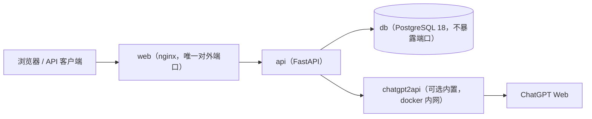

# PicSystem

基于 chatgpt2api 上游的多用户 AI 服务管理与在线使用系统：邀请码注册、按次额度、功能开关、用户密钥 API（newapi 风格）、统一管理后台。

> 上游能力来自 [chatgpt2api](https://github.com/yukkcat/chatgpt2api)（对话 / 联网搜索 / 文生图 / 图生图 / PPT / PSD）。
> 本系统作为其前置网关与用户体系：上游地址与密钥只需配置一处，终端用户无需接触上游密钥。

## 功能总览

| 角色 | 功能 |
| :--- | :--- |
| 普通用户 | 邀请码注册（自定义或随机生成凭证，支持注册审批制）· 首次登录滚动阅读并同意免责协议 · 对话（SSE 流式 / 多会话 / Markdown / 代码高亮 / 上游标记自动过滤）· 文生图 / 图生图（多参考图 / 图库）· 联网搜索（引用来源）· PPT / PSD 任务（进度轮询 / 下载）· 我的文件 · 个人 API 密钥（OpenAI 兼容 `/v1`）· 每日签到与兑换码领额度 · 双池额度（限时优先扣减）· 额度与调用记录查询 · 登录设备管理（陌生设备一键注销） |
| 管理员 | 仪表盘（用户量 / 今日请求 / 成功率 / 在途请求 / 7 天趋势 / 功能分布 / 活跃用户 / 系统存储一览）· 用户管理（新建 / 编辑额度与存储上限 / 备注 / 并发 / 审批 / 统计 / 重置密码 / 删除）· 邀请码管理（次数与四项额度 / 有效期 / 停用）· 兑换码管理（纯额度兑换，永久或限时池，支持固定到期点）· 批量调额（全员或多选，永久/限时池加减设）· 调用日志（筛选 / 自动刷新）· 风控中心（登录锁定 / 限流阈值 / 注册防刷与设备指纹防多注册 / 内容关键词拦截 / 风控事件）· 上游账号（面板内直接管理 chatgpt2api 账号：列表筛选与分组过滤 / 8 种导入模式 / 批量启停与删除 / 批量同步额度 / 账号组管理，上游零端口暴露）· 存储与清理（系统存储总占用：磁盘 / 数据库 / 产物分类一览 + 可清理预估 + 一键手动清理，用户存储配额 / 产物与日志保留策略）· 功能开关与注册开关 · 签到配置 · 公告弹窗 · 站点与协议设置（内置默认值一键填入二次修改）· 上游配置与连通性测试 · 审计日志 |

- **额度制度**：目前全部按次数计费（绘图按张数），`usage_logs` 已预留 token 与 cost 字段，便于后续扩展 token / 价格体系
- **功能开关**：对话、绘图、搜索、PPT/PSD 与注册均可单独开关，实时生效
- **上游热切换**：管理后台可直接修改上游地址 / 密钥并一键测试连通性，也可回退到 `.env` 环境变量
- **存储治理**：每用户存储配额（全局默认 + 个人覆盖）、产物保留时长（如 24 小时自动删除）、日志保留策略与孤儿文件清理，后台每小时自动执行
- **上游升级**：与上游 chatgpt2api 仅通过 OpenAI 兼容契约集成，升级/验证/回滚步骤见 [docs/UPSTREAM.md](./docs/UPSTREAM.md)

### 上游账号导入

管理后台 → 上游账号 → 导入账号，与上游 chatgpt2api 控制台口径一致，共 8 种模式：

| 模式 | 说明 |
| :--- | :--- |
| 导入 Access Token | 一行一个（忽略空行与 `#` 注释行、自动去重），也可读取 TXT 文件 |
| 导入 Session JSON | 粘贴 `https://chatgpt.com/api/auth/session` 的完整 JSON，保留 AT / RT / ID Token |
| 导入完整备份文件 | 读取完整备份 JSON，直接恢复凭据与账号配置（不请求远程验证） |
| 导入 CPA JSON 文件 | 从一个或多个 CPA JSON 提取凭据并同步账号与额度 |
| 导入 Sub2API JSON 文件 | 同上，Sub2API 口径 |
| OAuth 登录已有账号 | 浏览器登录 ChatGPT 后回填 callback，保存 RT 用于 AT 临期自动续期 |
| 从远程 CPA 导入 | 选择已保存的 CPA 连接 → 加载远端文件 → 勾选导入 |
| 从 Sub2API 导入 | 选择连接与远端分组，支持按远端分组自动创建/复用同名账号组 |

JSON 文件解析在浏览器侧完成，兼容数组根与 `accounts / items / results / data` 等容器、`credentials / credential /
tokens / auth` 等嵌套凭据对象，以及 `access_token / accessToken / token` 字段别名。
导入后自动同步账号与额度；若出现同步失败，会提示是否移除「本次确认已失效」的账号。
上游适配细节与字段白名单见 [docs/UPSTREAM-ADMIN-API.md](./docs/UPSTREAM-ADMIN-API.md)。

> 出于「上游密钥不出服务端」的设计前提，上游的**账号导出**接口未被代理（它会下发 access token 原文）；
> 确有需要时请按 docs/UPSTREAM-ADMIN-API.md 第 2 节的临时通道使用上游控制台。

## 架构



| 容器 | 镜像 | 说明 |
| :--- | :--- | :--- |
| `web` | 本地构建（nginx:1.27-alpine） | 前端静态资源 + 反向代理 `/api`、`/v1`，**唯一对外端口** |
| `api` | 本地构建（python:3.13-slim） | 业务后端，非 root 运行，仅内网 |
| `db` | postgres:18-alpine | 应用数据库，命名卷持久化，不暴露端口 |
| `chatgpt2api` | ghcr.io/yukkcat/chatgpt2api | 可选内置上游（profile `builtin-upstream`），**默认零端口暴露** |

> 需要访问内置上游控制台（添加 ChatGPT 账号）时，在 `.env` 加一行
> `COMPOSE_FILE=docker-compose.yml:docker-compose.console.yml` 后 `docker compose up -d`，
> 控制台即绑定到 `127.0.0.1:3000`（仅本机回环）。远程运维也可用 SSH 隧道访问。
> 管理面板「系统设置 → 上游服务 → 打开上游控制台」内置了该指引。

## 快速部署

前置要求：已安装 Docker（含 compose 插件）。全新 Ubuntu 服务器可一行安装：`curl -fsSL https://get.docker.com | bash`

### 一键部署（推荐）

Linux / macOS：

```bash
git clone https://github.com/hajimilvdou/picsystem.git
cd picsystem
bash deploy.sh
```

Windows（PowerShell）：

```powershell
git clone https://github.com/hajimilvdou/picsystem.git
cd picsystem
powershell -ExecutionPolicy Bypass -File deploy.ps1
```

脚本会交互确认：**对外端口**（默认 9090）、**是否内置上游 chatgpt2api**（默认内置）、**管理员账号**（密码留空则自动生成 96 位熵随机强密码），随后自动写入 `.env`（数据库密码 / JWT 密钥 / 上游密钥全部随机生成）并构建启动全部服务。

全部使用默认值、免交互：

```bash
bash deploy.sh --yes            # Linux / macOS
.\deploy.ps1 -Yes               # Windows
```

### 部署完成后

| 入口 | 地址 |
| :--- | :--- |
| 站点（用户端 + 管理后台） | `http://<服务器IP>:9090` |
| 内置 2api 控制台（默认零端口暴露，需按上方说明开启） | `http://127.0.0.1:3000` |

**查看初始管理员账号密码**：部署完成时脚本会在终端展示一次；忘记后可随时在项目目录查看（`.env` 仅当前用户可读）：

```bash
grep ADMIN_ .env                                  # Linux / macOS
Get-Content .env | Select-String ADMIN_           # Windows PowerShell
```

> `ADMIN_USERNAME / ADMIN_PASSWORD` 仅在**首次启动建库**时生效；之后改 `.env` 不影响已有账号，登录后可在「个人中心 → 修改密码」更换。
> 内置 2api 的原面板密钥（`UPSTREAM_API_KEY`）由脚本随机生成，仅供系统内部对接使用，日常运营无需理会。
> **内置上游模式**：部署后需先在 2api 控制台添加 ChatGPT 账号，对话/绘图等功能才会真正可用。
> **外部上游模式**：部署脚本中选择 external 并提供 2api 的 URL 与 Key，或之后在「系统设置 → 上游服务」中修改。

### 手动 docker compose（可选，不推荐）

```bash
cp .env.example .env   # 填写 ADMIN_PASSWORD / JWT_SECRET / UPSTREAM_API_KEY / POSTGRES_PASSWORD
# 内置上游时：
mkdir -p data/chatgpt2api && printf '{}\n' > data/chatgpt2api-config.json
COMPOSE_PROFILES=builtin-upstream docker compose up -d --build
# 外部上游时（把 .env 的 UPSTREAM_BASE_URL 改为外部地址）：
docker compose up -d --build
```

### 常用运维命令

```bash
docker compose logs -f        # 查看日志
docker compose restart        # 重启
docker compose down           # 停止（数据保留在卷中）
docker compose pull && docker compose up -d --build   # 更新
```

## 版本更新与数据保留

更新步骤（已有部署升级到新版本）：

```bash
cd picsystem
cp .env .env.backup        # 建议先备份配置
git pull
bash deploy.sh             # 提示「直接复用并启动？」时直接回车
```

数据库表结构升级（迁移）**在 api 容器启动时自动完成**，无需手写 SQL、无需清库。
部署脚本在健康检查通过后会打印一次迁移结果，也可以随时查看：

```bash
docker compose exec api python -m app.migrate status
```

> ⚠️ **不要**在「检测到已有 .env 配置，直接复用并启动？」时选 `n`。选 `n` 会重新生成一份新配置，
> 导致 `POSTGRES_PASSWORD` 与已初始化的数据库不匹配（服务起不来）、`JWT_SECRET` 变化（全部会话失效）、
> `ADMIN_PASSWORD` 变化（旧管理员密码作废）。旧配置会被备份为 `.env.bak.<时间戳>`，可以救回来但会中断服务。
> 非交互场景用 `bash deploy.sh --yes`（等价于全部选默认，即复用）。

**数据放在哪里**（只要不执行下表的危险操作，升级都不会丢数据）：

| 位置 | 内容 | 什么操作会清空它 |
| :--- | :--- | :--- |
| 卷 `db-data` | 用户、额度、邀请码、兑换码、日志、产物索引 | `docker compose down -v`、`docker volume rm` |
| 卷 `app-data` | 用户产物实物（图片 / PPT / PSD） | 同上 |
| 卷 `chatgpt2api-runtime`、目录 `./data/chatgpt2api` | 上游账号池与设置 | 同上（目录需手动删） |
| `.env` | 全部密钥与管理员密码 | 重新部署时选 `n`（会先备份） |

`docker compose up -d --build`、`restart`、`pull`、`down`（**不带 `-v`**）都不会动这些卷；
`.env` 与 `data/` 均在 `.gitignore` 内，`git pull` 不会覆盖。

> `db-data` 挂载到容器的 `/var/lib/postgresql`（而非 17 及以前的 `/var/lib/postgresql/data`）：
> postgres 18 起 `PGDATA` 改为 `/var/lib/postgresql/<主版本>/docker`，官方镜像的挂载点也上移到了父目录，
> 继续挂载旧路径会被入口脚本判定为遗留挂载点并拒绝启动。

**升级前建议备份**（数据库用户名以 `.env` 的 `POSTGRES_USER` 为准，默认 `picsystem`）：

```bash
cp .env .env.backup
docker compose exec -T db pg_dump -U picsystem picsystem > backup-$(date +%F).sql
docker run --rm -v picsystem_app-data:/data -v "$PWD":/backup alpine tar czf /backup/app-data.tgz /data
```

迁移框架的开发者约定（如何新增迁移、双方言差异、失败处理）见 [docs/MIGRATIONS.md](./docs/MIGRATIONS.md)。

> 上游镜像默认是 `latest`，而「上游账号」页依赖上游的内部管理 API，生产环境建议在 `.env` 固定版本：
> `CHATGPT2API_IMAGE=ghcr.io/yukkcat/chatgpt2api:v3.2.3`

## 域名反代（HTTPS）

系统已适配在域名反向代理之后运行：内置 nginx 会透传外部反代的 `X-Forwarded-Proto / X-Forwarded-Host`，
后端据此生成正确的外网链接（如 `/v1` 返回的文件下载地址）。把 `HTTP_PORT` 映射的端口再用任意反代挂到域名即可。

**推荐拓扑**：外部反代与站点同机时，在 `.env` 中设置 `HTTP_BIND=127.0.0.1:` 与 `XFF_MODE=$proxy_add_x_forwarded_for`
（仅本机反代可达本站，真实客户端 IP 经由外层反代透传且不可伪造）。

以 Nginx 为例（`HTTPS_PORTAL`、Nginx Proxy Manager 等面板同理，开启 Websocket/SSE 支持即可）：

```nginx
server {
    listen 443 ssl;
    server_name pic.example.com;
    # ssl_certificate / ssl_certificate_key ...
    add_header Strict-Transport-Security "max-age=31536000" always;   # 可选：强制 HTTPS

    location / {
        proxy_pass http://127.0.0.1:9090;          # HTTP_PORT 映射的端口
        proxy_http_version 1.1;
        proxy_set_header Host $host;
        proxy_set_header X-Real-IP $remote_addr;
        proxy_set_header X-Forwarded-For $remote_addr;   # 关键：覆盖（而非追加）客户端伪造的 XFF
        proxy_set_header X-Forwarded-Proto $scheme;      # 关键：把 https 传给后端
        proxy_set_header X-Forwarded-Host $host;
        proxy_set_header Connection "";
        proxy_buffering off;                          # SSE 流式必需
        proxy_read_timeout 600s;                      # 生图/PPT 耗时较长
        client_max_body_size 100m;                    # 图生图上传
    }
}
```

启用 HTTPS 后，请在 `.env` 中设置 `COOKIE_SECURE=true` 并 `docker compose up -d`，使会话 Cookie 带 Secure 标记。

## 用户 API（newapi 风格）

用户在「API 密钥」页创建 `sk-` 密钥后，即可按 OpenAI 兼容方式调用，按各自额度按次扣费：

```bash
curl http://<服务器IP>:9090/v1/chat/completions \
  -H "Content-Type: application/json" \
  -H "Authorization: Bearer sk-你的密钥" \
  -d '{"model":"auto","messages":[{"role":"user","content":"你好"}],"stream":true}'
```

| 接口 | 功能 | 计费 |
| :--- | :--- | :--- |
| `GET /v1/models` | 模型目录 | 免费 |
| `POST /v1/chat/completions` | 对话（支持 stream） | 1 次/次 |
| `POST /v1/search` | 联网搜索 | 1 次/次 |
| `POST /v1/images/generations` | 文生图 | n 次/次（按张数，失败退还） |
| `POST /v1/images/edits` | 图生图（multipart） | n 次/次 |
| `POST /v1/ppt/generations` · `POST /v1/psd/generations` | 创建 PPT/PSD 任务 | 1 次/次（失败退还） |
| `GET /v1/editable-file-tasks?ids=` | 任务查询 | 免费 |
| `GET /v1/files/{id}/download` | 下载 API 生成的文件 | 免费 |

## 安全与风控

- 密码 argon2 哈希；会话为 httpOnly + SameSite=Strict Cookie（JWT，改密/重置/禁用即失效全部旧会话）
- 网页端写操作要求自定义防伪头（防 CSRF，含登录 CSRF）；登录/注册接口 IP 限流（10 次/分钟）
- **登录防爆破**：连续失败（默认 5 次）按用户名临时锁定（默认 15 分钟），管理员可在风控中心即时解锁
- **用户级限流**：功能调用默认每用户 20 次/分钟；API 密钥固定 60 次/分钟，超限写入风控事件
- **注册防刷**：邀请码 + 单 IP 每日注册上限（默认 10），邀请码校验信息刻意模糊防枚举
- **风控中心**：登录失败/锁定/限流/注册拦截事件全量记录，阈值在线可调
- API 密钥只存 sha256，明文仅创建时展示一次；上游密钥不出服务端，后台页面仅显示掩码
- 全部 SQL 经 ORM 参数化；输入经 pydantic 校验；文件路径白名单 + 随机文件名 + 越界校验
- nginx 安全响应头（CSP / nosniff / DENY / no-referrer）；仅 web 暴露端口，数据库零暴露；后端容器非 root 运行
- `.env` 权限 600 且默认不提交（已入 .gitignore）；管理端关键操作写入审计日志

## 本地开发

```bash
# 后端（Python 3.13，默认 SQLite，无需 PostgreSQL）
cd backend
python -m venv .venv && .venv/Scripts/activate   # Windows；Linux/macOS 用 source .venv/bin/activate
pip install -r requirements.txt
uvicorn app.main:app --reload                    # http://127.0.0.1:8000

# 前端（Node 20+，开发服务器代理 /api 与 /v1 到 8000）
cd frontend
npm install
npm run dev                                      # http://127.0.0.1:5173

# 后端冒烟测试（不依赖上游）
python smoke_test.py
```

开发时上游相关环境变量可直接用 shell 注入，例如 `UPSTREAM_BASE_URL=http://127.0.0.1:3000 UPSTREAM_API_KEY=xxx`。

## 环境变量

| 变量 | 默认 | 说明 |
| :--- | :--- | :--- |
| `HTTP_PORT` | `9090` | 对外 HTTP 端口 |
| `ADMIN_USERNAME` / `ADMIN_PASSWORD` | — | 初始管理员（仅首次启动创建） |
| `JWT_SECRET` | 必填 | 会话签名密钥（≥32 字节随机串） |
| `UPSTREAM_BASE_URL` | `http://chatgpt2api` | 上游地址（后台可在线覆盖） |
| `UPSTREAM_API_KEY` | 必填 | 上游密钥；内置模式同时作为 2api 的 AUTH_KEY |
| `POSTGRES_*` | — | 内联 PostgreSQL，不暴露端口 |
| `COOKIE_SECURE` | `false` | HTTPS 反代时置 `true` |
| `CHATGPT2API_CONSOLE_PORT` | `3000` | 内置 2api 控制台（仅 127.0.0.1） |
| `MIGRATIONS_LOCK_TIMEOUT_SECONDS` | `120` | 等待数据库迁移锁的上限（仅多实例部署时相关） |
| `MIGRATIONS_SKIP_DESTRUCTIVE` | 未设置 | 设为 `true` 时跳过标记破坏性的迁移 |

## 项目结构

```
├── deploy.sh / deploy.ps1    # 一键部署
├── docker-compose.yml        # 四服务编排（db / api / web / 可选 chatgpt2api）
├── docker-compose.console.yml# 可选叠加：暴露内置上游控制台到本机回环
├── docs/UPSTREAM.md          # 上游升级 / 验证 / 回滚指南
├── docs/UPSTREAM-ADMIN-API.md# 上游账号管理 API 适配预案（路线 C）
├── docs/MIGRATIONS.md        # 数据库迁移：如何新增一条迁移与双方言约定
├── backend/                  # FastAPI 后端
│   ├── app/routers/          # auth、chat、search、images、ppt、files、keys、admin_*、v1
│   ├── app/services/         # 上游代理、额度、存储、清理、统计、任务同步、风控、会话
│   ├── app/migrations/       # 版本化迁移框架（启动自动执行）+ versions/ 迁移脚本
│   └── app/migrate.py        # 迁移 CLI：status / up / --dry-run / --target
└── frontend/                 # Vue 3 + Element Plus 前端
    ├── src/views/            # 用户端页面
    └── src/views/admin/      # 管理端页面
```

## 许可与免责

- 本项目代码以 [MIT](./LICENSE) 发布
- 上游 chatgpt2api 由其作者以 AGPL-3.0 发布，内置部署时其镜像与能力仍受其条款约束；请遵守其服务条款与当地法律法规，勿用于违规用途
